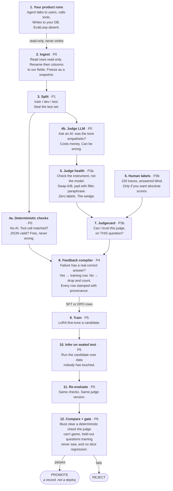

# EvalLoop

**A configurable evaluation and improvement control plane for AI products.**

Bring your production traces. Define deterministic checks and LLM-judge questions in YAML. Find out
whether your judge is trustworthy *before* you trust its numbers. Compile failures into training data
that records where every signal came from. Fine-tune a candidate. Promote it only after sealed
re-evaluation against something the training loop could not influence.

**Ground truth is not a precondition.** Most teams have production traces and no labels, and cannot
cheaply get them. The default path is judge-derived signal — every training row records its provenance
and the judge's measured health at build time, so nothing is trusted blindly and nothing is blocked for
lack of a dataset you were never going to have.

---

## Start here

```bash
evalloop judge-health eval-suite.yaml --traces snapshot-1
```

No labels. No ground truth. Returns things like:

```
question: policy_followed
  position bias        31%  ← flips when you swap A and B
  verbosity delta      18%  ← prefers longer answers
  self-consistency    0.62  ← disagrees with itself
VERDICT: this judge is not measuring what you think it is.
```

If your judge flips on a third of paraphrases, every eval number you have is noise, and no amount of
model work will fix it.

---

## The flow



Each stage narrows: thousands of raw logs → hundreds of results → a handful of judge verdicts → one
decision.

## What it costs you

Nothing below T3 asks for a single label.

| Tier | You provide | You get |
|---|---|---|
| **T0 Deterministic** | nothing | schema validity, tool-call correctness, hallucinated IDs, policy rules, cost, p95 latency |
| **T1 Judge health** | nothing | position / verbosity / formatting / paraphrase bias, self-consistency, invalid-output rate |
| **T2 Regression detection** | nothing | candidate vs baseline, per-slice regressions, gate on relative conditions |
| **T3 Judge calibration** | ~150 labels (≈90 min) | κ against a *measured* human ceiling, confusion matrix, per-class precision |
| **T4 Training** | T1 pass | SFT/DPO compilation, LoRA fine-tune, promotion decision |

**Relative claims are free. Absolute claims cost labels.** Without T3, EvalLoop will tell you a candidate
beat its baseline. It will refuse to tell you the model is 87% good.

---

## Why this exists

**A judge nobody checked is not a measurement.** Teams ship dashboards built on a judge that flips when
you swap A and B, or reliably prefers whichever answer is longer. The dashboard is green and the numbers
mean nothing. EvalLoop checks the instrument before reporting the reading — with zero labels.

**Training on a judge is fine. Grading with the same judge is not.** If the judge that mints your
preference pairs also scores your gate, the candidate is optimized to please the grader and then graded
by it. It passes by construction, and the failure is silent and inverted: judge scores rise while quality
falls. Three defences, none of which need a third model — a deterministic floor in every gate, held-out
questions that never reach training data, and an automatic reject when judge scores climb while
deterministic pass rate drops.

**Honesty is provenance, not prohibition.** Refusing to emit a row for lack of ground truth just means
you get no rows. Every row instead carries its own audit trail:

```json
{ "target_source": "judge_preference_pair", "signal_provenance": "judge",
  "judge_version": "sha256:a91f...",
  "judge_health": { "verbosity_delta": 0.06, "position_flip_rate": 0.04, "self_consistency": 0.91 } }
```

A failure with no legitimate target is still **dropped and counted** — `dropped_no_target` is a number
you can act on, and a list of exactly which traces are worth labelling first. Ground truth you already
have but never recorded as such: human handoffs, confirmed tool side-effects, business outcomes, user
retries.

## What it will not claim

- **A candidate cannot exceed its judge** on judged dimensions. Fine-tuning against a stronger judge is
  distillation, not alchemy.
- **Uncalibrated scores are relative only.** Judge bias is roughly constant; constants cancel in a
  comparison and do not cancel in an absolute score.
- **Promotion is a record, not a deploy.** Nothing ships automatically.

---

## Two models, distinct providers

Base model (open-weights, served and fine-tuned) and judge (API) must not share a provider — judges
measurably favour their own family's outputs.

```yaml
models:
  base: { provider: huggingface, model: Qwen/Qwen2.5-7B-Instruct }
judge:
  provider: anthropic
  model: claude-sonnet-5
integrity:
  require_distinct_providers: [base, judge]
  gate:
    holdout_questions: [policy_followed]   # never compiled into training data
    deterministic_required: true           # a judge cannot game a JSON parser
    block_on_divergence: true              # judge ↑ while deterministic ↓ = REJECT
```

`evalloop validate` treats a violation as an error, not a warning.

## Trace format

You provide a mapping, not a migration. `ground_truth` is **optional** — supply what you have,
including nothing.

```json
{
  "trace_id": "call-123",
  "input":  { "messages": [], "user_request": "Cancel my order" },
  "output": {
    "text": "Certainly, I have cancelled it.",
    "tool_calls": [{ "name": "cancel_order", "arguments": { "order_id": "ORD-42" } }],
    "artifacts": [{ "type": "audio", "uri": "s3://bucket/call-123.wav" }]
  },
  "ground_truth": { "tool_calls": [...], "policy_followed": true },
  "metadata": { "language": "en", "customer_tier": "premium" }
}
```

`ground_truth` does two jobs. `tool_calls` and `expected_response` are **targets**, feeding the feedback
compiler. `policy_followed` is a **label** — a human verdict on a judge question, feeding the judgecard.
Most teams start with neither and acquire the second first.

```yaml
mapping:
  trace_id:                id
  input.user_request:      user_transcript
  output.tool_calls:       tool_calls_json
  output.artifacts[0].uri: recording_url
  ground_truth.tool_calls: expected_tool_calls   # optional
```

---

## CLI

```bash
evalloop validate     project.yaml eval-suite.yaml
evalloop ingest       project.yaml --dry-run --limit 5   # source row -> mapped trace, side by side
evalloop snapshot     show <snapshot_id>

evalloop judge-health eval-suite.yaml --traces <snapshot>    # no labels required
evalloop evaluate     eval-suite.yaml --split dev --budget-usd 2

evalloop label        export <run_id> --pool anchor --n 100  # blind human labelling
evalloop label        import anchor.jsonl
evalloop judgecard    <run_id> --probes --html out/card.html

evalloop feedback     build <run_id> --strategy dpo
evalloop feedback     show  <dataset_id>                 # manifest + dropped-reason histogram

evalloop train        training.yaml
evalloop infer        candidate-v3 --split test
evalloop compare      baseline candidate-v3 --gate promotion.yaml
evalloop bundle       <comparison_id> --out bundles/
```

## Non-negotiable rules

1. Every dataset snapshot is versioned.
2. Every judge configuration is hashed.
3. Every evaluation result stores its evaluator version.
4. LLM calls are cached, keyed by judge version.
5. Connectors are read-only by default.
6. PII redaction happens before external judge calls.
7. Judge-derived feedback is never *unlabelled* — provenance, judge version, and judge health on every row.
8. A judge that fails its health checks cannot mint training data.
9. Base model provider and judge provider are never the same.
10. Every promotion gate contains at least one deterministic condition.
11. Held-out judge questions never reach training data.
12. Training data never enters the sealed test set.
13. A candidate is never automatically deployed.
14. Cost and token usage are first-class metrics.

Each is enforced by a test, not by convention.

## Voice AI

| Layer | Method | Status |
|---|---|---|
| Tool behaviour — which tool, correct arguments, did it succeed | Deterministic | P0 |
| Transcript behaviour — empathy, concision, policy compliance | LLM judge over transcript | P0 |
| Audio behaviour — speech rate, pitch, pauses, pronunciation | Audio model / signal processing | P8 |

A text LLM cannot judge acoustic tone from a transcript, and fine-tuning a text model cannot change
pitch or cadence — those belong to TTS configuration or TTS training. Traces carry the recording as a
URI reference; nothing reads it before P8.

---

## Status

Pre-alpha, building P0.

| Step | | |
|---|---|---|
| P0.1 | ✅ | Docker stack, CLI entry point |
| P0.2 | ✅ | Trace and result contracts |
| P0.3 | ✅ | Config contracts for all five YAML files |
| P0.4 | ⬜ | Metastore, migrations, artifact store |
| P0.5 | ⬜ | `evalloop validate` with line-accurate errors |
| P0.6 | ⬜ | JSONL ingest |
| P0.7 | ⬜ | Exact-match evaluator, judge client, one LLM question |
| P0.8 | ⬜ | Example project and end-to-end acceptance test |

**Code layout, invariants, extension points:** [`ARCHITECTURE.md`](ARCHITECTURE.md)
**Design and decisions:** [`plan/000-build-plan.md`](plan/000-build-plan.md) (P0 → P6, plus P7+
roadmap) and [`plan/001-trusted-judge-architecture.md`](plan/001-trusted-judge-architecture.md),
which supersedes parts of it.

```bash
make install && make check     # sync deps, then lint + mypy --strict + tests
make up                        # metastore + stand-in source database
```

**Stack:** Python 3.11+ · Pydantic v2 · Postgres + SQLAlchemy 2 + Alembic · Parquet · Typer + Rich ·
httpx · TRL/peft/transformers (optional `[train]`)

**License:** Apache-2.0
