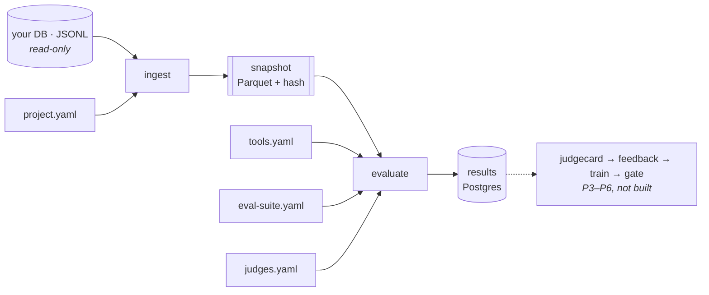

# EvalLoop

**An evaluation and improvement control plane for AI products.**

Point it at production traces. Declare checks in YAML. Find out whether your judge is trustworthy
before you trust its numbers, compile failures into training data that records where every signal
came from, and promote a candidate only against something the training loop could not influence.

**Ground truth is not a precondition.** Most teams have traces and no labels. Tool correctness comes
from a registry you already wrote; judge questions report their own provenance. Nothing is blocked
for lack of a dataset you were never going to have.

---

## Quickstart

```bash
make install && make up                                    # deps + Postgres

evalloop validate examples/support-bot/*.yaml              # every config, line-accurate errors
evalloop ingest   examples/support-bot/project.yaml --dry-run --limit 5
evalloop ingest   examples/support-bot/project.yaml        # → immutable snapshot
evalloop evaluate examples/support-bot/eval-suite.yaml --split train
```

Last command prints a per-check table with pass / fail / not-applicable, cost, and cache hits.
Everything above runs today; see [Status](#status) for what does not.

## Architecture



Each stage narrows: thousands of raw rows → hundreds of results → a handful of verdicts → one
decision. Connectors never write to your database.

## The files

| File | Declares | Example |
|---|---|---|
| `project.yaml` | source, column mapping, splits, redaction, integrity rules | [↗](examples/support-bot/project.yaml) |
| `tools.yaml` | tools the agent may call, per node | [↗](examples/support-bot/tools.yaml) |
| `eval-suite.yaml` | the checks that run against a snapshot | [↗](examples/support-bot/eval-suite.yaml) |
| `judges.yaml` | judge models, one or many | [↗](examples/support-bot/judges.yaml) |
| `promotion.yaml` · `training.yaml` | gate conditions, LoRA config (P5–P6) | [↗](examples/support-bot/) |

A trace is your data, renamed — no migration, no `ground_truth` key:

```json
{ "trace_id": "call-123",
  "input":  { "user_request": "Cancel my order" },
  "output": { "text": "Certainly, I have cancelled it.",
              "tool_calls": [{ "name": "cancel_order", "arguments": { "order_id": "ORD-42" } }] },
  "metadata": { "language": "en", "customer_tier": "premium" } }
```

```yaml
mapping:
  trace_id:           id
  input.user_request: user_transcript
  output.tool_calls:  tool_calls_json
```

## Tool correctness, without labels

`tools.yaml` is the definitions your agent already hands the model on every request, exported —
config, not annotation ([`plan/002`](plan/002-tool-registry-and-selection.md)).

```yaml
nodes:
  refunds: { tools: [issue_refund, open_warranty_claim, lookup_order] }
tools:
  issue_refund:
    description: Refund an order to the original payment method. Irreversible.
    arguments: { order_id: {type: string, required: true}, amount: {type: number, required: true} }
    side_effecting: true
```

| Check | Asks | Catches |
|---|---|---|
| `tool_registry_check` | is this call legal? | tool that does not exist · not permitted at this node · arguments off-schema · side-effecting call repeated |
| `tool_selection` | which tool *should* have been called? | wrong choice among legal tools — the judge picks from the catalogue **without seeing the call**, and every tool called must be in its `acceptable` set |

`tool_registry_check` is objective, so it is the deterministic floor every promotion gate must
contain. `tool_selection` computes a target where ground truth would have stored one, so its rows
carry the judge hash and support relative claims only.

**Ground truth stays optional**, with two jobs and neither of them tool correctness: `policy_followed`
and friends are *labels* feeding the judgecard; `expected_tool_calls` and `expected_response` are
*targets* feeding the feedback compiler, and belong on cases you authored. A check with no ground
truth reports `not applicable`, never a failure.

## What it costs you

| Tier | You provide | You get |
|---|---|---|
| **T0** Deterministic | nothing | tool legality, schema validity, hallucinated IDs, cost, p95 latency |
| **T1** Judge health | nothing | position / verbosity / paraphrase bias, self-consistency, invalid-output rate |
| **T2** Regression | nothing | candidate vs baseline, per-slice regressions, relative gate conditions |
| **T3** Calibration | ~150 labels (≈90 min) | κ against a *measured* human ceiling, confusion matrix, FAIL-class precision |
| **T4** Training | T1 pass | SFT/DPO compilation, LoRA fine-tune, promotion decision |

**Relative claims are free. Absolute claims cost labels.** Without T3, EvalLoop will say a candidate
beat its baseline. It will refuse to say the model is 87% good.

## Why

- **A judge nobody checked is not a measurement.** A judge that flips when you swap A and B makes
  every number downstream noise. Check the instrument before reporting the reading — zero labels.
- **Training on a judge is fine; grading with the same judge is not.** The candidate is optimised to
  please the grader, then graded by it, and passes by construction. Three defences, no third model:
  a deterministic floor in every gate, held-out questions training never sees, and an automatic
  reject when judge scores climb while deterministic pass rate falls.
- **Honesty is provenance, not prohibition.** Refusing to emit a row for lack of ground truth just
  means no rows. Every row instead carries `target_source`, `signal_provenance`, `judge_version`,
  and the judge's measured health at build time.
- **A candidate cannot exceed its judge.** Fine-tuning against a stronger judge is distillation, not
  alchemy. Promotion is a record, not a deploy.

## Guarantees

Each is enforced by a test, not by convention.

1. Every snapshot is versioned; every judge config and evaluator is hashed onto every result.
2. LLM calls are cached, keyed by judge version — a rubric edit can never reuse an old answer.
3. Connectors are read-only. PII redaction runs before any external judge call.
4. A judge failing its health checks cannot mint training data.
5. Base model provider ≠ judge provider — judges favour their own family's outputs.
6. Every gate contains a deterministic condition; held-out questions never reach training data.
7. Training data never enters the sealed test set. A candidate is never deployed automatically.
8. Tool correctness never requires ground truth; a judge assessing a call is never shown the call.
9. Cost and token usage are first-class metrics.

## Status

**P0 complete** — ingest → evaluate runs end to end with queryable, fully-attributed results.

| | |
|---|---|
| ✅ P0.1–P0.8 | contracts, metastore, `validate`, JSONL ingest, deterministic + judge evaluators, cache, CI |
| ✅ plan/002 | tool registry, `tool_registry_check`, `tool_selection` |
| ⬜ P1 · P2.5 | real connectors, redaction, splits, latent ground-truth harvesting |
| ⬜ P3a → P6 | `judge-health`, judgecard, feedback compiler, LoRA training, promotion gate |

`judge-health`, `judgecard`, `label`, `feedback`, `train`, `compare` and `bundle` appear in the
design docs and do not exist yet. The Quickstart above is the whole of what runs today.

**Voice:** traces carry audio as a URI. Tool and transcript layers are evaluated now; acoustic
evaluation is P8 — a text judge cannot hear tone, and fine-tuning a text model cannot change pitch.

---

**Code layout and extension points:** [`ARCHITECTURE.md`](ARCHITECTURE.md)
**Design decisions:** [`plan/`](plan/README.md) — [000](plan/000-build-plan.md) build plan,
[001](plan/001-trusted-judge-architecture.md) trusted judge, [002](plan/002-tool-registry-and-selection.md) tool registry

**Stack:** Python 3.11+ · Pydantic v2 · Postgres + SQLAlchemy 2 + Alembic · Parquet · Typer + Rich ·
httpx · TRL/peft/transformers (optional `[train]`) — **License:** Apache-2.0
