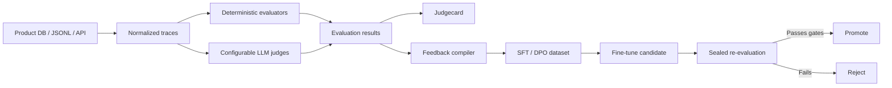

# EvalLoop

**A configurable evaluation and improvement control plane for AI products.**

Bring your production traces and ground truth. Define deterministic checks and arbitrary LLM-judge
questions in YAML. Measure whether the judge itself is trustworthy. Compile *verified* failures into
training datasets. Fine-tune a candidate. Promote it only after sealed re-evaluation.

EvalLoop is not a benchmark. It is the pipeline between "this trace was wrong" and "a better model is
in production" — and it refuses to let you skip the parts that make that claim defensible.

---

## The loop



## Six modules

| Module | Does |
|---|---|
| **Data ingestion** | Reads your production traces read-only and maps them into a common trace format. No schema change to your database. |
| **Evaluation engine** | Deterministic matchers (exact, JSON, regex, numeric, set, tool-exec, custom Python) plus LLM evaluators, producing one normalized result stream. |
| **Configurable LLM judge** | Provider + model + prompt + rubric + response schema + parser, versioned as a single hash. Change one rubric sentence and you get a new judge version. |
| **Judgecard** | Per-question agreement, confusion matrix, κ, bootstrap CIs, invalid-output rate, position/verbosity/formatting bias. Answers "can I trust this judge, on *this* question?" |
| **Feedback compiler** | Converts verified failures into SFT/DPO rows — and drops the ones with no legitimate target instead of inventing one. |
| **Fine-tuning & promotion** | One trainer interface (TRL LoRA first), candidate inference, baseline comparison, and a promotion gate with slice-level regression rules. |

---

## Why this exists

A score of zero is not a training signal.

"Bad response + judge says bad" does not tell a trainer what the response should have been. A training
example needs a real target: a ground-truth response, a correct ground-truth tool call, a human
correction, an approved exemplar, an executably verified correction, or a trusted teacher correction.

EvalLoop enforces this. Failures without a legitimate target are **dropped and counted**, so
`dropped_no_target` becomes a number you can act on rather than a gap you paper over.

The same principle applies to the judge itself: if a custom question has no ground truth, EvalLoop will
report the judge's answer, but marks it explicitly:

```
Measured:                    Yes
Calibrated against GT:       No
Eligible as training signal: No
```

That flag is read from the database by the feedback compiler. You cannot bypass it by editing YAML.

---

## Common trace format

Every product stores data differently, so you provide a mapping rather than a migration.

```json
{
  "trace_id": "call-123",
  "input":  { "messages": [], "user_request": "Cancel my order" },
  "output": {
    "text": "Certainly, I have cancelled it.",
    "tool_calls": [{ "name": "cancel_order", "arguments": { "order_id": "ORD-42" } }],
    "artifacts": [{ "type": "audio", "uri": "s3://bucket/call-123.wav" }]
  },
  "ground_truth": {
    "tool_calls": [{ "name": "cancel_order", "arguments": { "order_id": "ORD-42" } }],
    "tone": "empathetic",
    "policy_followed": true
  },
  "metadata": { "product": "voice-agent", "language": "en", "customer_tier": "premium" }
}
```

```yaml
source:
  type: postgres
  query: |
    SELECT * FROM production_traces
    WHERE created_at >= :start_date

mapping:
  trace_id:                  id
  input.user_request:        user_transcript
  output.text:               assistant_transcript
  output.tool_calls:         tool_calls_json
  output.artifacts[0].uri:   recording_url
  ground_truth.tool_calls:   expected_tool_calls
  ground_truth.tone:         expected_tone
```

---

## CLI

```bash
evalloop validate  project.yaml eval-suite.yaml
evalloop ingest    project.yaml --dry-run --limit 5     # source row -> mapped trace, side by side
evalloop ingest    project.yaml
evalloop snapshot  show <snapshot_id>                   # splits + redaction report

evalloop evaluate  eval-suite.yaml --split dev --budget-usd 2
evalloop judgecard <run_id> --probes --html out/card.html

evalloop feedback  build <run_id> --strategy dpo
evalloop feedback  show  <dataset_id>                   # manifest + dropped-reason histogram

evalloop train     training.yaml
evalloop infer     candidate-v3 --split test
evalloop compare   baseline candidate-v3 --gate promotion.yaml
evalloop bundle    <comparison_id> --out bundles/
```

---

## Non-negotiable engineering rules

1. Every dataset snapshot is versioned.
2. Every judge configuration is hashed.
3. Every evaluation result stores its evaluator version.
4. LLM calls are cached, keyed by judge version.
5. Connectors are read-only by default.
6. PII redaction happens before external judge calls.
7. Judge feedback without ground truth is never trusted automatically.
8. Training data never enters the sealed test set.
9. A candidate is never automatically deployed.
10. Cost and token usage are first-class metrics.

Each of these is enforced by a test, not by convention. See `plan/000-build-plan.md`.

---

## Voice AI

Voice evaluation splits into three layers, and EvalLoop is honest about which it covers:

| Layer | Method | Status |
|---|---|---|
| Tool behaviour — which tool, correct arguments, did it succeed | Deterministic | P0 |
| Transcript behaviour — empathy, concision, flow, policy compliance | LLM judge over transcript | P0 |
| Audio behaviour — speech rate, pitch, pauses, pronunciation | Multimodal/audio model or signal processing | P8 |

A text LLM cannot reliably judge acoustic tone from a transcript. Equally, fine-tuning a text model
improves its wording but cannot change pitch, cadence, or pronunciation — those belong to the TTS
model's configuration or training.

---

## Status

Pre-alpha. Building P0. See [`plan/000-build-plan.md`](plan/000-build-plan.md) for the full phased plan
(P0 contracts → P6 promotion gate, plus the P7+ roadmap).

## Stack

Python 3.11+ · Pydantic v2 · Postgres + SQLAlchemy 2 + Alembic · Parquet artifact store · Typer + Rich ·
httpx · TRL/peft/transformers (optional `[train]` extra)

## License

Apache-2.0
