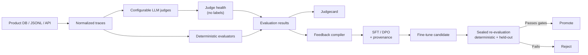

# EvalLoop

**A configurable evaluation and improvement control plane for AI products.**

Bring your production traces. Define deterministic checks and arbitrary LLM-judge questions in YAML.
Find out whether your judge is trustworthy *before* you trust its numbers. Compile failures into
training data that records where every signal came from. Fine-tune a candidate. Promote it only after
sealed re-evaluation against something the training loop could not influence.

EvalLoop is not a benchmark. It is the pipeline between "this trace was wrong" and "a better model is
in production."

**Ground truth is not a precondition.** Most teams have production traces and no labels, and cannot
cheaply get them. EvalLoop's default path is judge-derived signal — every training row records its
provenance and the judge's measured health at build time, so nothing is trusted blindly and nothing is
blocked for lack of a dataset you were never going to have.

---

## Start here

```bash
evalloop judge-health eval-suite.yaml --traces snapshot-1
```

No labels. No ground truth. No setup beyond a suite file. Returns things like:

```
question: policy_followed
  position bias        31%  ← flips on A/B swap
  verbosity delta      18%  ← prefers longer answers
  self-consistency    0.62  ← disagrees with itself
  invalid output       4%

VERDICT: this judge is not measuring what you think it is.
```

If your judge flips on a third of paraphrases, every eval number you have is noise, and no amount of
model work will fix it. That is the first thing worth knowing and it costs you nothing to find out.

---

## The loop



## What you get, and what it costs you

Each tier is independently useful. Nothing below T3 asks you for a single label.

| Tier | You provide | You get |
|---|---|---|
| **T0 Deterministic** | nothing | schema validity, tool-call correctness, hallucinated IDs, policy rules, cost, p95 latency |
| **T1 Judge health** | nothing | position / verbosity / formatting / paraphrase bias, self-consistency, invalid-output rate |
| **T2 Regression detection** | nothing | candidate vs baseline, per-slice regressions, promotion gate on relative conditions |
| **T3 Judge calibration** | ~150 labels (≈90 min) | κ against a measured human ceiling, confusion matrix, per-class precision — unlocks absolute claims |
| **T4 Training** | T1 pass | SFT/DPO compilation, LoRA fine-tune, promotion decision |

**Relative claims are free. Absolute claims cost labels.** Without T3, EvalLoop will tell you a
candidate beat its baseline; it will refuse to tell you the model is 87% good, and it will not let an
uncalibrated question sit behind an `absolute` condition in a promotion gate.

## Seven modules

| Module | Does |
|---|---|
| **Data ingestion** | Reads your production traces read-only and maps them into a common trace format. No schema change to your database. |
| **Evaluation engine** | Deterministic matchers (exact, JSON, regex, numeric, set, tool-exec, custom Python) plus LLM evaluators, producing one normalized result stream. |
| **Configurable LLM judge** | Provider + model + prompt + rubric + response schema + parser, versioned as a single hash. Change one rubric sentence and you get a new judge version. |
| **Judge health** | Position, verbosity, formatting and paraphrase bias; self-consistency; invalid-output rate. Requires no ground truth, so it runs on day one — and gates whether a judge is allowed to mint training data at all. |
| **Judgecard** | Per-question agreement, confusion matrix, κ, bootstrap CIs, measured against human-human agreement rather than an imaginary 1.0. Answers "can I trust this judge, on *this* question?" |
| **Feedback compiler** | Converts failures into SFT/DPO rows, each stamped with where its signal came from and how healthy the judge was at the time. Drops the ones with no legitimate target instead of inventing one. |
| **Fine-tuning & promotion** | One trainer interface (TRL LoRA first), candidate inference, baseline comparison, and a promotion gate with slice-level regression rules and a deterministic floor the judge cannot game. |

---

## Why this exists

**A judge nobody checked is not a measurement.** Teams ship eval dashboards built on an LLM judge that
flips its answer when you swap A and B, or reliably prefers whichever response is longer. The dashboard
is green. The numbers mean nothing. EvalLoop checks the instrument before it reports the reading, and it
does that with zero labels.

**Training on a judge is fine. Grading with the same judge is not.** If the judge that mints your
preference pairs also scores your promotion gate, the candidate is optimized to please the grader and
then graded by it. It passes by construction. The failure is silent and inverted: judge scores rise
while quality falls. EvalLoop breaks that circle three ways — a deterministic floor in every gate,
held-out judge questions that never reach the training data, and an automatic reject when judge scores
climb while deterministic pass rate drops.

**Honesty is provenance, not prohibition.** Refusing to emit a row because it lacks ground truth just
means you get no rows. Every row EvalLoop emits instead carries its own audit trail:

```json
{
  "target_source": "judge_preference_pair",
  "signal_provenance": "judge",
  "judge_version": "sha256:a91f...",
  "judge_health": { "verbosity_delta": 0.06, "position_flip_rate": 0.04, "self_consistency": 0.91 }
}
```

Nothing is blocked. Nothing is unaccounted for. Six months later you can answer "where did this training
data come from" from the dataset itself.

**A score of zero is still not a training signal.** "Bad response + judge says bad" does not tell a
trainer what the response should have been. A row is emitted only against a real target: a ground-truth
response, a correct ground-truth tool call, a human correction, an approved exemplar, an executably
verified correction, a trusted teacher correction, or a judge preference pair from a judge that passed
its health checks. Failures with no legitimate target are **dropped and counted**, so
`dropped_no_target` becomes a number you can act on — and a list of exactly which traces are worth
labelling first.

---

## What EvalLoop will not claim

**A candidate cannot exceed its judge on judged dimensions.** Fine-tuning an open-weights base against
a stronger judge's preferences moves it *toward* that judge. This is usually the point — you are
compressing expensive quality into something cheap enough to serve — but it is distillation, not
alchemy, and the README says so rather than letting you find out at iteration four.

**Uncalibrated scores are relative only.** Judge bias is largely a constant, and constants cancel inside
a comparison. They do not cancel inside an absolute score.

**Promotion is a record, not a deploy.** Nothing ships automatically.

---

## Two models, distinct providers

| Role | Model |
|---|---|
| **Base** — served and fine-tuned | open-weights, local (TRL LoRA) |
| **Judge** — mints preference pairs and scores the gate | API provider |

```yaml
models:
  base:
    provider: huggingface
    model: Qwen/Qwen2.5-7B-Instruct

judge:
  provider: anthropic
  model: claude-sonnet-5

integrity:
  require_distinct_providers: [base, judge]   # judges favour their own family's outputs
  gate:
    holdout_questions: [policy_followed]      # never compiled into training data
    deterministic_required: true              # a judge cannot game a JSON parser
    block_on_divergence: true                 # judge ↑ while deterministic ↓ = REJECT
```

`evalloop validate` treats a violation as an error, not a warning.

---

## Common trace format

Every product stores data differently, so you provide a mapping rather than a migration.
`ground_truth` is **optional** — supply what you have, including nothing.

```json
{
  "trace_id": "call-123",
  "input":  { "messages": [], "user_request": "Cancel my order" },
  "output": {
    "text": "Certainly, I have cancelled it.",
    "tool_calls": [{ "name": "cancel_order", "arguments": { "order_id": "ORD-42" } }],
    "artifacts": [{ "type": "audio", "uri": "s3://bucket/call-123.wav" }]
  },
  "ground_truth": {
    "tool_calls": [{ "name": "cancel_order", "arguments": { "order_id": "ORD-42" } }],
    "tone": "empathetic",
    "policy_followed": true
  },
  "metadata": { "product": "voice-agent", "language": "en", "customer_tier": "premium" }
}
```

`ground_truth` does two different jobs. `tool_calls` and `expected_response` are **targets** — they feed
the feedback compiler. `policy_followed` is a **label** — a human verdict on a judge question, feeding
the judgecard. Most teams start with neither and acquire the second first.

```yaml
source:
  type: postgres
  query: |
    SELECT * FROM production_traces
    WHERE created_at >= :start_date

mapping:
  trace_id:                  id
  input.user_request:        user_transcript
  output.text:               assistant_transcript
  output.tool_calls:         tool_calls_json
  output.artifacts[0].uri:   recording_url
  ground_truth.tool_calls:   expected_tool_calls    # optional
  ground_truth.tone:         expected_tone          # optional
```

### Ground truth you already have

Most products leak targets without recording them as such. EvalLoop harvests these rather than asking
you to label from scratch:

| Source | Yields |
|---|---|
| **Human handoff** — the agent failed and a person took over | the person's action is the correct action |
| **Executable verification** — the tool ran and the side effect was confirmed | a verified correct tool call |
| **Business outcome** — order completed, ticket closed without reopen | a weak binary label |
| **Retry / rephrase** — the user repeated themselves | an implicit failure marker |

---

## Calibrating the judge, cheaply

When you do want absolute claims, the ask is bounded: **150 labels plus 30 double-labelled, roughly 90
minutes of one domain expert.**

```bash
evalloop label export <run_id> --pool anchor   --n 100 --out anchor.jsonl
evalloop label export <run_id> --pool targeted --n 50  --out targeted.jsonl
evalloop label import anchor.jsonl targeted.jsonl
```

Three things make those 150 labels worth more than 1500 random ones:

- **Two pools.** Random sampling on a 90%-pass product finds five failures. The anchor pool (random)
  gives an unbiased κ; the targeted pool (stratified, plus judge-vs-deterministic disagreements, plus
  traces where the judge flipped under paraphrase) measures precision on the failure class.
- **Blind.** The human never sees the judge's verdict. Showing it produces agreement, not measurement.
- **A measured ceiling.** Thirty traces are labelled twice, by two people. If two experts agree only 72%
  of the time on "was the tone empathetic", then a judge at κ 0.6 is close to ceiling and excellent.
  Without that number, κ is uninterpretable.

Labels are bound to a judge version hash. Edit one rubric sentence and the card marks itself
`STALE — labels collected against judge v3, current judge is v4`.

**The metric that matters is not overall agreement.** A judge that wrongly says *fail* mints a training
pair teaching the model to stop doing something correct — actively harmful. A judge that wrongly says
*pass* just misses an opportunity. Feedback eligibility gates on precision of the failure class, not κ
alone.

---

## CLI

```bash
evalloop validate     project.yaml eval-suite.yaml
evalloop ingest       project.yaml --dry-run --limit 5     # source row -> mapped trace, side by side
evalloop ingest       project.yaml
evalloop snapshot     show <snapshot_id>                   # splits + redaction report

evalloop judge-health eval-suite.yaml --traces <snapshot>  # no labels required
evalloop evaluate     eval-suite.yaml --split dev --budget-usd 2

evalloop label        export <run_id> --pool anchor --n 100
evalloop label        import anchor.jsonl
evalloop judgecard    <run_id> --probes --html out/card.html

evalloop feedback     build <run_id> --strategy dpo
evalloop feedback     show  <dataset_id>                   # manifest + dropped-reason histogram

evalloop train        training.yaml
evalloop infer        candidate-v3 --split test
evalloop compare      baseline candidate-v3 --gate promotion.yaml
evalloop bundle       <comparison_id> --out bundles/
```

---

## Non-negotiable engineering rules

1. Every dataset snapshot is versioned.
2. Every judge configuration is hashed.
3. Every evaluation result stores its evaluator version.
4. LLM calls are cached, keyed by judge version.
5. Connectors are read-only by default.
6. PII redaction happens before external judge calls.
7. Judge-derived feedback is never *unlabelled* — every row carries its provenance, judge version, and judge health.
8. A judge that fails its health checks cannot mint training data.
9. The base model provider and the judge provider are never the same.
10. Every promotion gate contains at least one deterministic condition.
11. Held-out judge questions never reach training data.
12. Training data never enters the sealed test set.
13. A candidate is never automatically deployed.
14. Cost and token usage are first-class metrics.

Each of these is enforced by a test, not by convention. See `plan/000-build-plan.md` and
`plan/001-trusted-judge-architecture.md`.

---

## Voice AI

Voice evaluation splits into three layers, and EvalLoop is honest about which it covers:

| Layer | Method | Status |
|---|---|---|
| Tool behaviour — which tool, correct arguments, did it succeed | Deterministic | P0 |
| Transcript behaviour — empathy, concision, flow, policy compliance | LLM judge over transcript | P0 |
| Audio behaviour — speech rate, pitch, pauses, pronunciation | Multimodal/audio model or signal processing | P8 |

A text LLM cannot reliably judge acoustic tone from a transcript. Equally, fine-tuning a text model
improves its wording but cannot change pitch, cadence, or pronunciation — those belong to the TTS
model's configuration or training.

---

## Status

Pre-alpha. Building P0. See [`plan/000-build-plan.md`](plan/000-build-plan.md) for the full phased plan
(P0 contracts → P6 promotion gate, plus the P7+ roadmap) and
[`plan/001-trusted-judge-architecture.md`](plan/001-trusted-judge-architecture.md) for the trusted-judge
architecture that supersedes parts of it.

## Stack

Python 3.11+ · Pydantic v2 · Postgres + SQLAlchemy 2 + Alembic · Parquet artifact store · Typer + Rich ·
httpx · TRL/peft/transformers (optional `[train]` extra)

## License

Apache-2.0
